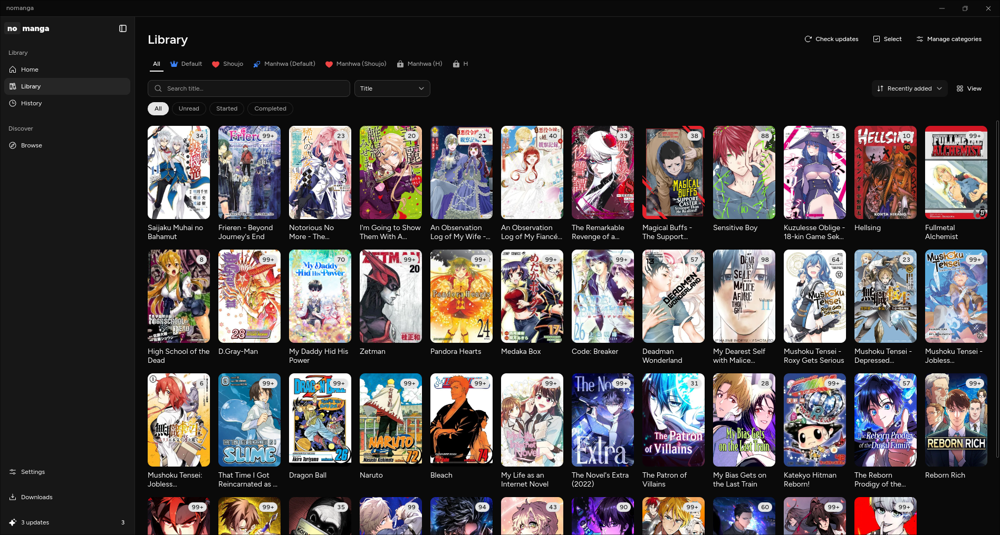
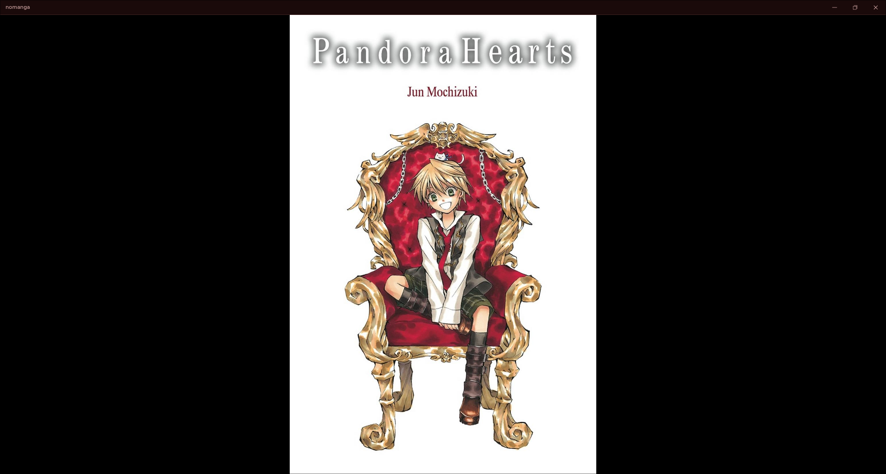

<div align="center">


# nomanga

**A cross-platform manga reader with a sandboxed, WASM-based extension system.**

[Install an extension](docs/extensions.md) ·
[Write a source](docs/writing-a-source.md) ·
[Architecture](docs/architecture.md) ·
[Build it](docs/building.md)

</div>

Sources — the sites manga is fetched from — are not baked into the app. They ship
as WebAssembly plugins running in an [Extism](https://extism.org) sandbox with an
explicit allow-list of hosts each may reach. The desktop app is Tauri + React;
everything below the UI is Rust.

> **Status:** early but usable. The engine, extension ABI, host and SQLite
> persistence are in place, and the desktop UI covers browsing, a categorised
> library, a multi-layout reader, downloads and read history. Sources ship in
> [their own repositories](docs/extensions.md#the-packs-built-here).

<div align="center">

</div>

## Features

- **Library** — categories with drag-to-reorder, private (hidden from *All*) and
  default shelves, per-category sort, and an accent colour/icon per shelf. Add a
  series straight into categories, edit an entry's shelves, or multi-select for
  bulk changes. Optional password lock on chosen categories.
- **Reader** — single/double-page and vertical-scroll (webtoon) layouts, zoom
  modes, reading direction, and a page scrubber. Settings resolve through a
  **Global → Source → Manga** hierarchy, so one title or a whole source can
  override the defaults.
- **Browse & search** — per-source homepage sections and search with searchable
  multi-select filters.
- **Downloads** — queue chapters for offline reading, with pause, per-chapter
  cancel and a live progress dialog.
- **History & updates** — history grouped by day/week/month, *Continue reading*
  that resumes on the exact page, and background update checks with desktop
  notifications.
- **Backup & sync** — gzipped JSON backups, and folder-based sync between
  machines with push/pull hooks for remotes a filesystem cannot reach.
- **Sandboxed sources** — every extension runs in a WASM sandbox and may only
  reach the hosts it declares up front, shown to you before you install it.

<div align="center">

</div>

## Quick start

Prerequisites: a Rust toolchain (edition 2024), `pnpm`, and the
[Tauri v2 system dependencies](https://tauri.app/start/prerequisites/) for your OS.

```sh
cd client
pnpm install
pnpm tauri dev
```

Then open **Settings → Extensions** and add a repository to get sources —
see [Installing extensions](docs/extensions.md).

Prebuilt bundles for Windows, macOS and Linux come from the `Build` workflow;
[Building & running](docs/building.md) covers the per-platform caveats, including
why Arch needs the PKGBUILD.

## Documentation

| | |
|---|---|
| [Installing extensions](docs/extensions.md) | Repository URLs, what the sandbox guarantees, the packs built here |
| [Writing a source](docs/writing-a-source.md) | Step by step, from `cargo new` to a working `.wasm` |
| [Publishing a repository](docs/publishing.md) | The index format, `publish.sh`, GitHub Pages, source icons |
| [Architecture](docs/architecture.md) | Crate layout, the extension ABI, the database |
| [Building & running](docs/building.md) | Dev builds, packaging, platform notes, the sqlx cache |
| [CLI reference](docs/cli.md) | Running a source without the app |

## Tech stack

Rust (workspace, edition 2024) · [Extism](https://extism.org) (WASM host/PDK) ·
[Tauri v2](https://tauri.app) · React 19 + Vite + TypeScript ·
[sqlx](https://github.com/launchbadge/sqlx) + SQLite ·
[specta](https://github.com/specta-rs/specta) / tauri-specta ·
`scraper` for HTML parsing.
