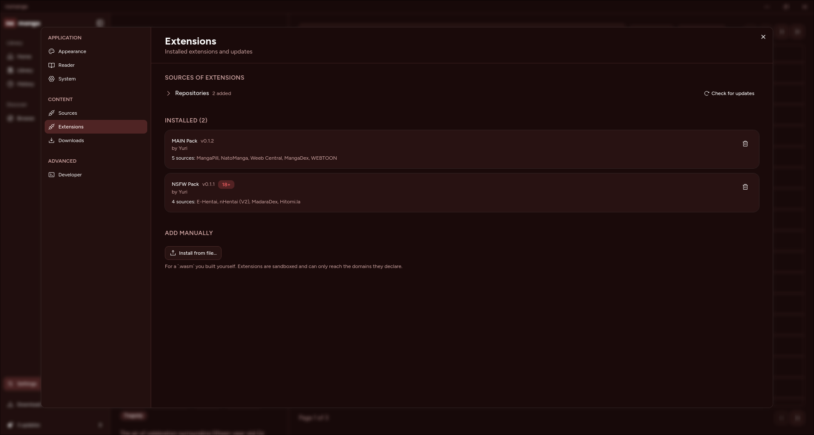

# Installing extensions

nomanga ships with no sources. You add them by pointing the app at a
**repository** — a URL serving a JSON index of what a publisher offers.

Open **Settings → Extensions**, expand *Repositories*, paste a URL and press
**Add**. What that repository offers then appears under *Available*.

## The packs built here

| Repository | Index URL | Sources |
|---|---|---|
| [nomanga-extension-mainpack](https://github.com/notreallyuri/nomanga-extension-mainpack) | `https://notreallyuri.github.io/nomanga-extension-mainpack/index.min.json` | WeebCentral, MangaDex, MangaPill, NatoManga, WEBTOON |
| [nomanga-extension-nsfw](https://github.com/notreallyuri/nomanga-extension-nsfw) | `https://notreallyuri.github.io/nomanga-extension-nsfw/index.min.json` | nHentai, Hitomi.la, MadaraDex, E-Hentai |

Adult sources living in a separate repository is deliberate: they are invisible to
anyone who has not added that second URL, so no content filter is needed on the
repository itself.

Each repository also serves a browsable page at its root — the same URL without
`index.min.json` — listing its sources and carrying an **Open in nomanga** button.

## What you are trusting

A repository URL is arbitrary code from a stranger. Two things contain it, and one
of them is shown to you:

- **The WASM sandbox.** An extension cannot touch your filesystem, and it cannot
  reach the network directly — every request goes through a host function.
- **The declared host allow-list.** An extension may only reach the domains it
  names up front. Installing shows you that list, and the host enforces it: a
  source that tries anything else is refused.

The index itself is *not* trusted. The app re-reads the downloaded `.wasm` and
takes its metadata from there, so a repository that lies about a version, an ABI,
or which sources an extension contains is caught at install time.

An extension whose `abi_version` falls outside what this build supports is flagged
in the list and cannot be installed.

## Installing from a link

A repository page's **Open in nomanga** button is a `nomanga://add-repo?url=…`
link. The app registers that scheme, focuses itself, jumps to Settings →
Extensions and asks you to confirm the URL.

A link can only ever *add a repository*. It cannot install anything — that stays a
separate, explicit step behind the host allow-list confirmation.

If clicking does nothing, the scheme is not registered:

- **Linux (packaged)** — comes from `MimeType=x-scheme-handler/nomanga` in the
  `.desktop` file, installed by the PKGBUILD or `packaging/install-local.sh`.
  Check with `xdg-mime query default x-scheme-handler/nomanga`.
- **Linux (dev)** — a `pnpm tauri dev` build registers it at startup.
- **Windows / macOS** — the NSIS installer and the app bundle respectively.

## Updating

Extensions do not update themselves yet. **Settings → Extensions → Check for
updates** refetches every repository; an installed extension a repository offers at
a different version grows an **Update to X** button on its card.

## Installing from a file

*Install from file…* takes a `.wasm` directly — for one you built yourself, or one
you were handed outside a repository. It goes through the same inspection and the
same sandbox; only the discovery step differs.

## Removing

The trash icon on an installed extension removes it, along with its stored
settings, its per-source preferences and its cached entries. Downloaded chapters
and library entries survive, since they are keyed by `(source_id, manga_id)` and
reattach if you reinstall.
